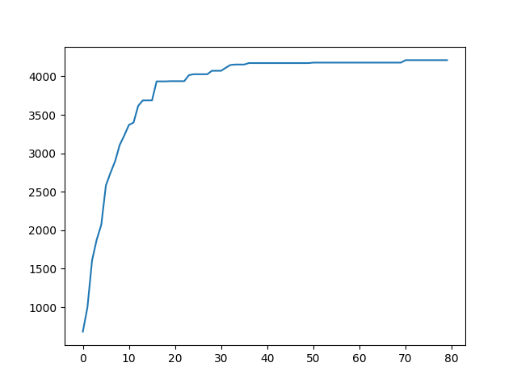

# 退火算法不同参数对收敛结果的影响

## 测试数据：

```
 "dimensionality":60,
        "package_weight":2400,
        "weight":[135,133,130,11,128,123,20,75,9,66,105,43,18,5,37,90,22,85,9,80,70,17,60,35,57,35,61,40,8,50,32,40,72,35,100,2,7,19,28,10,22,27,30,88,91,47,68,108,10,12,43,11,20,37,17,4,3,21,10,67],
        "price":[350,310,300,295,290,287,283,280,272,270,265,251,230,220,215,212,207,203,202,200,198,196,190,182,181,175,160,155,154,140,132,125,110,105,101,92,83,77,75,73,72,70,69,66,60,58,45,40,38,36,33,31,27,23,20,19,10,9,4,1],
        "best":8362,
        "best_weight":2393
```

## 参数：

```
初始解集init[dimensionality] 请确保初始解集合法
  
重量weight[dimensionality]
  
价值price[dimensionality]

背包容量pw，默认为 0

初始温度T，默认为 200

退火率af 默认为 0.95

迭代次数time 默认为 20

平衡次数balance 默认为 5
```

## 测试集：

### 1

T=200 af=0.95 time=20 balance=5


T=400 af=0.95 time=20 balance=5


T=600 af=0.95 time=20 balance=5


T=400 af=0.95 time=80 balance=5


T=400 af=0.85 time=80 balance=5


T=400 af=0.75 time=80 balance=5


T=400 af=0.65 time=80 balance=5


T=400 af=0.95 time=80 balance=10



T=400 af=0.95 time=80 balance=15


T=400 af=0.95 time=80 balance=20


